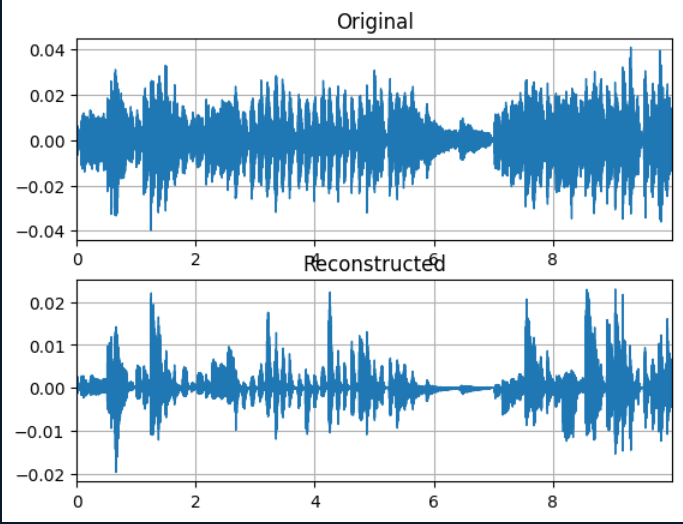
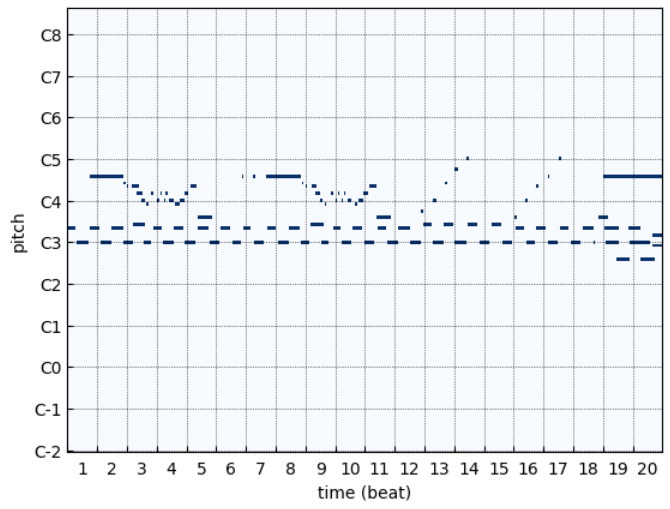

# Gan-MusicGeneration

## Introduction

The objective of this Epitech Hub's Project is to generate music using a Generative Adversarial Network (GAN) or an Auto Encoder (AE). The GAN/AE are mainly used to generate images, but I wanted to explore the interest of using them to generate music. The project will be done in Python using Keras.

## Task to complete

| Task | Time Estimated | Definition of Done | Status |
| ---- | -------------- |  ------------------ | ------ |
| Research on the subject | 2 days | [x] Find 8 interesting papers on how to generate music <br> [/] Summarizes their techniques <br> [x] Find 5 interesting datasets for our case <br> [x] Describe the content of the dataset and list the type music that can be generated with each dataset | ❌ |
| Prepare the dataset | 2 days |  [x] Format the dataset in order to be used in the training process of the desired GAN <br> [x] Handle error case in the dataset (iex: if MIDI, handle empty tracks) <br> [x] Handle error case in the dataset (if music not encoded in the same way) | ✅ |
| Implement a GAN or a AE | 2 days |  [x] Research on how to implement the choosen GAN (put sources) <br> [x] Implement the GAN in a simple case (such as MINST) <br> [x] Train the GAN in order that it is able to generate image | ✅ |
| Convert the GAN to handle music file | 2 days | [x] Research on how to use music data in a GAN <br> [x] Implement the GAN on the dataset <br> [x] Train the GAN in order that it is able to generate music | ✅ |
|-|-|-|-|
| TOTAL| 8 days | 12/13 DODs | ✅ |

## How to use the project

### Requirements

- Python 3.11
- FluidSynth
- Juptyer Notebook

> Other requirements are listed in the `requirements.txt` file

### Installation

```bash
git clone git@github.com:nathan-hoche/GAN-MusicGeneration.git
```

### Usage

In order to launch the training process, you have multiple steps to follow:
1. Download the [Maestro Dataset](https://magenta.tensorflow.org/datasets/maestro) (In MIDI format)
2. Launch SelectMidi.ipynb in order to select the MIDI files you want to use
3. Launch the training process using the main.ipynb file (`/!\ Think to change the path of the desired MIDI file for the sampling`)

In order to generate music, you have to launch the generator.ipynb file. (`/!\ The model has to be trained before.`)

## Project Details

### Dataset

The dataset used for this project is the [Maestro Dataset](https://magenta.tensorflow.org/datasets/maestro). The reason why I choose this dataset is because I wanted to generate a piece of music in the style of a specific composer. This project can be easily adapted to generate music in another style by using the same dataset. It is also possible to use another dataset, but it will require to adapt the code.

[0] Curtis Hawthorne, Andriy Stasyuk, Adam Roberts, Ian Simon, Cheng-Zhi Anna Huang, Sander Dieleman, Erich Elsen, Jesse Engel, and Douglas Eck. "Enabling Factorized Piano Music Modeling and Generation with the MAESTRO Dataset." In International Conference on Learning Representations, 2019.

### Preprocessing

In order to use the audio files in the GAN, I first try to use spectrogram. But I quickly realized that it was not the best way to do it. I tried to make a spectrogram from a sample of the dataset and reverse the process using torchAudio (Can be found [here](archive/Reconstruction.ipynb)) , but I got this result:



As you can see, the reconstruction is not good enough to be used in a GAN. So I decided to use the MIDI files, which are a better way to represent music (each note is represented by a number), this type of file is used to reproduce music in a digital way.

In order to counter the problem, I decided to use the MIDI files. The MIDI files are a better way to represent music (each note is represented by a number), this type of file is used to reproduce music in a digital way. Moreover, I decided to use the piano roll representation of the MIDI files, which is a way to know at which time a note is played and for how long. (Can be found [here](archive/PianoRollConvertion.ipynb))



### Model

First, In order to learn how to create a GAN, I decided to make a GAN which would be able to generate mnist images. I want to specially thank the authors of [this repository](https://github.com/eriklindernoren/Keras-GAN), which was a big help in my understanding on how to implement GAN. (Can be found [here](archive/MNIST-GAN.ipynb))

After the GAN creation, I tried to create a simple AutoEncoder in order to understand how to use the MIDI files in the GAN. This AutoEncoder use a list of notes at a time T and the durations of each notes to predict the next note. But, I quickly realized that I needed more understanding on how to make a GAN for music generation. My first try used a simple AutoEncoder with Embedding layers for the notes and duration, but the learning process was not good enough to recover the original music. (Can be found [here](archive/SimpleAutoEncoder.ipynb))

After more research, I decide to use the piano roll representation of the MIDI files as input of the GAN. In order to do so, I use the `pypianoroll` library to convert the MIDI files to piano roll representation. I first tried to recreate an original music from the piano roll representation, and the result was pretty good. (Can be found [here](archive/MusicRecover.ipynb))

| Epoch 10 | Epoch 100 | Epoch 150 |
| -------- | --------- | --------- |
| [here](data/wav/result-1Sample-10epochs.wav) | [here](data/wav/result-1Sample-100epochs.wav) | [here](data/wav/result-1Sample-150epochs.wav) |

So, I decided to use this representation in the GAN. I used the same architecture as the one used in the MNIST GAN, but I changed the input and output shape of the generator and the discriminator. The generator takes a random noise as input and output a piano roll representation of the music. The discriminator takes a piano roll representation of the music as input and output a binary value (0 or 1) which represent if the music is real or fake. With this architecture, I was able to generate music. (Can be found [here](main.ipynb) or [here](generator.ipynb)).

In order to train the model, I decided to use 100 samples of the same music. The result was fine, but need to be improved in order to be used in a real case. (Can be found [here](main.ipynb)).

### Results

I got this result:

| Epoch 1000 | Epoch 1500 | Epoch 2000 | Epoch 3500 |
| ---------- | ---------- | ---------- | ---------- |
| [here](data/wav/result-100Samples-1000epochs.wav) | [here](data/wav/result-100Samples-1500epochs.wav) | [here](data/wav/result-100Samples-2000epochs.wav) | [here](data/wav/result-100Samples-3500epochs.wav) |

As you can see, the result is fine, but need to be improved. I make some observation on the result:
1. The model has difficulties in order to stay in the same key (repeat a lot the same note). This can possibly be improved by adding recurrent layers in the generator, in order to remember the previous notes.
2. As the model has difficulties to stay in the same key, currently it converges to a single melody. After ~2000 epochs, the model generates the same melody over and over again. This problem can be fixed when the first problem is fixed.
3. The model starts with a lot of notes and take a lot of time to reduce the number of notes. This can possibly be fixed by adding a dropout layer in the generator, in order to reduce the number of notes at the beginning of the generation.

### Conclusion

The result is fine, but need to be improved in order to be used in a real case. I will continue to work on this project in order to improve the result. I will try to implement a memory in the generator, in order to remember the previous notes. Also, I will try to reduce the number of notes at the beginning of the generation.

## Interesting Papers

| Name | Link | Year | Note |
| ---- | ---- | ---- | ---- |
| GANSynth | [Github](https://github.com/magenta/magenta/tree/main/magenta/models/gansynth) / [Papers](https://magenta.tensorflow.org/gansynth) | 2019 |  |
| JukeBox | [Github](https://github.com/openai/jukebox/) / [Papers](https://openai.com/research/jukebox) | 2020 |  |
| MuseGAN | [Github](https://github.com/salu133445/musegan) / [Papers](https://salu133445.github.io/musegan/pdf/musegan-aaai2018-paper.pdf) | 2018 |  |
| MuseNet | [Papers](https://openai.com/research/musenet) | 2019 |  |
| MidiNet | [Github](https://github.com/RichardYang40148/MidiNet/tree/master/v1) / [Papers](https://arxiv.org/abs/1703.10847) | 2017 |  |
| C-RNN-GAN | [Papers](https://arxiv.org/pdf/1611.09904.pdf) | 2016 |  |
| WaveNet | [Papers](https://arxiv.org/pdf/1609.03499v2.pdf) | 2016 |  |
| WaveGAN | [Papers](https://arxiv.org/pdf/1802.04208v3.pdf) | 2019 |  |
| Music Transformer | [Website](https://magenta.tensorflow.org/music-transformer) / [Papers](https://arxiv.org/pdf/1809.04281.pdf) | 2018 |  |

## Interesting Dataset

| Name | Link | DataType | Type of Music | Number of Music | Note |
| ---- | ---- | -------- | ------------- | --------------- | ---- |
| BitMidi | [link](https://bitmidi.com) | MIDI | ALL | 113,000+ |  |
| Classical Archives | [link](https://www.classicalarchives.com/newca/#!/) | MIDI/Music | Classical | 20,000+ Midi / 934,000 audio file |  |
| MAESTRO | [link](https://magenta.tensorflow.org/datasets/maestro) | MIDI/Audio | Pianist | 200 hours of performance | |
| Classical Music Midi | [link](https://www.kaggle.com/datasets/soumikrakshit/classical-music-midi/data?select=bach) | MIDI | Classical | 295 Midi |  |
| GTZAN Dataset - Music Genre Classification | [link](https://www.kaggle.com/datasets/andradaolteanu/gtzan-dataset-music-genre-classification/data) | Audio | All | 1000 audio file |  |
